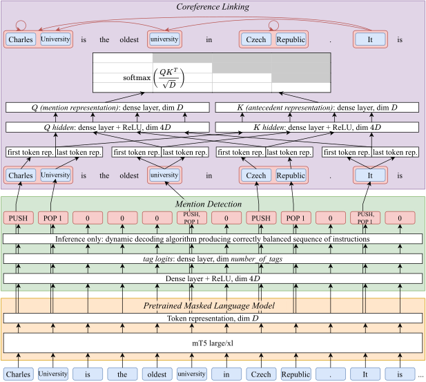

# CorPipe 23: CRAC 2023 Winning System for Multilingual Coreference Resolution

This repository contains the source code of CorPipe 23, which is available under
the MPL-2.0 license. The architecture of CorPipe 23 is described in the following
paper:

---



<h3 align="center"><a href="https://arxiv.org/abs/2311.14391">ÚFAL CorPipe at CRAC 2023: Larger Context Improves Multilingual Coreference Resolution</a></h3>

<p align="center">
  <b>Milan Straka</b><br>
  Charles University<br>
  Faculty of Mathematics and Physics<br>
  Institute of Formal and Applied Lingustics<br>
  Malostranské nám. 25, Prague, Czech Republic
</p>

**Abstract:** We present CorPipe, the winning entry to the CRAC 2023 Shared Task
on Multilingual Coreference Resolution. Our system is an improved version of our
earlier multilingual coreference pipeline, and it surpasses other participants
by a large margin of 4.5 percent points. CorPipe first performs mention
detection, followed by coreference linking via an antecedent-maximization
approach on the retrieved spans. Both tasks are trained jointly on all available
corpora using a shared pretrained language model. Our main improvements comprise
inputs larger than 512 subwords and changing the mention decoding to support
ensembling. <br clear="both">

---

## Content of this Repository

- The directory `data` is for the CorefUD 1.1 data, and the preprocessed
  and tokenized version needed for training.
  - The script `data/get.sh` downloads and extracts the CorefUD 1.2 training and
    development data, plus the unannotated test data of the CRAC 2023 shared
    task.

- The `corpipe23.py` is the complete CorPipe 23 source file.

- The `corefud-score.sh` is an evaluation script used by `corpipe23.py`, which
  - performs evaluation (using the official evaluation script from the `corefud-scorer` submodule),
  - optionally (when `-v` is passed), it also:
    - runs validation (using the official UD validator from the `validator` submodule) on the output data,
    - performs evaluation with singletons,
    - performs evaluation with exact match.

- The `res.py` is our script for visualizing performance of running and finished
  experiments, and for comparing two experiments. It was developed for our needs
  and we provide it as-is without documentation.

## Training the CorPipe 23 “Single mT5 Large” Model

To train a single multilingual model on all the data using `mT5 large`, you should
1. run the `data/get.sh` script to download the CorefUD 1.1 data,
2. create a Python environments with the packages listed in `requirements.txt`,
3. train the model itself using the `corpipe23.py` script.

   For training a mT5-large variant with square-root mix ratios and without treebank ids, use
   ```sh
   tb="ca_ancora cs_pcedt cs_pdt de_parcorfull de_potsdamcc en_gum en_parcorfull es_ancora fr_democrat hu_korkor hu_szegedkoref lt_lcc no_bokmaalnarc no_nynorsknarc pl_pcc ru_rucor tr_itcc"
   ratios_sqrt="8.4 14.0 11.7 1.4 2.4 5.6 1.4 8.8 6.9 2.0 4.6 2.5 6.5 6.0 9.5 5.1 3.1"

   corpipe23.py --train --dev --treebanks $(for c in $tb; do echo data/$c/$c-corefud-train.conllu; done) --resample 8000 $ratios_sqrt --epochs=15 --batch_size=8 --adafactor --learning_rate=6e-4 --learning_rate_decay --encoder=google/mt5-large --segment=512 --right=50 --label_smoothing=0.2 --exp=mt5-large
   ```

## Predicting with a CorPipe 23 Model

To predict with a trained model, use the following arguments:
```sh
corpipe23.py --load model_checkpoint_path --exp target_directory --epoch 0 --test input1.conllu input2.conllu
```
- the direcotry with the model checkpoint must contain also the `options.json` and `tags.txt` files;
- the outputs are generated in the target directory, with `epoch00` added to the file name;
- if you want to also evaluate the predicted files, you can use `--dev` option instead of `--test`;
- optionally, you can pass `--segment 2560` to specify longer context size, which very likely produces
  better results, but needs more GPU memory.
